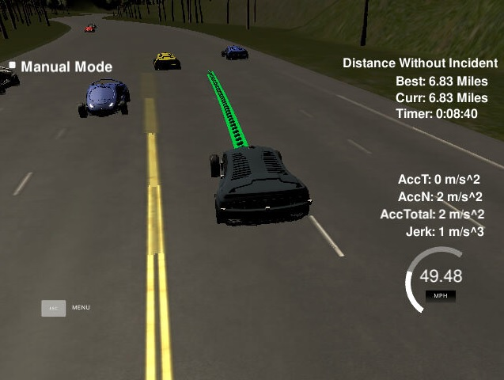

# CarND-Path-Planning-Project
Self-Driving Car Engineer Nanodegree Program
   
### Simulator.
You can download the Term3 Simulator which contains the Path Planning Project from the [releases tab (https://github.com/udacity/self-driving-car-sim/releases/tag/T3_v1.2).  

To run the simulator on Mac/Linux, first make the binary file executable with the following command:
```shell
sudo chmod u+x {simulator_file_name}
```

### Overview
This project goal is to safely navigate around a virtual highway with other traffic that is driving +-10 MPH of the 50 MPH speed limit. Car's localization and sensor fusion data will be provide from simulator., there is also a sparse map list of waypoints around the highway. The car should try to go as close as possible to the 50 MPH speed limit, which means passing slower traffic when possible, note that other cars will try to change lanes too. The car should avoid hitting other cars at all cost as well as driving inside of the marked road lanes at all times, unless going from one lane to another. The car should be able to make one complete loop around the 6946m highway. Since the car is trying to go 50 MPH, it should take a little over 5 minutes to complete 1 loop. Also the car should not experience total acceleration over 10 m/s^2 and jerk that is greater than 10 m/s^3.

#### The map of the highway is in data/highway_map.txt
Each waypoint in the list contains  [x,y,s,dx,dy] values. x and y are the waypoint's map coordinate position, the s value is the distance along the road to get to that waypoint in meters, the dx and dy values define the unit normal vector pointing outward of the highway loop.

The highway's waypoints loop around so the frenet s value, distance along the road, goes from 0 to 6945.554.

## Basic Build Instructions

1. Clone this repo.
2. Make a build directory: `mkdir build && cd build`
3. Compile: `cmake .. && make`
4. Run it: `./path_planning`.

Here is the data provided from the Simulator to the C++ Program

#### Main car's localization Data (No Noise)

["x"] The car's x position in map coordinates

["y"] The car's y position in map coordinates

["s"] The car's s position in frenet coordinates

["d"] The car's d position in frenet coordinates

["yaw"] The car's yaw angle in the map

["speed"] The car's speed in MPH

#### Previous path data given to the Planner

//Note: Return the previous list but with processed points removed, can be a nice tool to show how far along
the path has processed since last time. 

["previous_path_x"] The previous list of x points previously given to the simulator

["previous_path_y"] The previous list of y points previously given to the simulator

#### Previous path's end s and d values 

["end_path_s"] The previous list's last point's frenet s value

["end_path_d"] The previous list's last point's frenet d value

#### Sensor Fusion Data, a list of all other car's attributes on the same side of the road. (No Noise)

["sensor_fusion"] A 2d vector of cars and then that car's [car's unique ID, car's x position in map coordinates, car's y position in map coordinates, car's x velocity in m/s, car's y velocity in m/s, car's s position in frenet coordinates, car's d position in frenet coordinates. 

## Details

1. The car uses a perfect controller and will visit every (x,y) point it recieves in the list every .02 seconds. The units for the (x,y) points are in meters and the spacing of the points determines the speed of the car. The vector going from a point to the next point in the list dictates the angle of the car. Acceleration both in the tangential and normal directions is measured along with the jerk, the rate of change of total Acceleration. The (x,y) point paths that the planner recieves should not have a total acceleration that goes over 10 m/s^2, also the jerk should not go over 50 m/s^3. (NOTE: As this is BETA, these requirements might change. Also currently jerk is over a .02 second interval, it would probably be better to average total acceleration over 1 second and measure jerk from that.

2. There will be some latency between the simulator running and the path planner returning a path, with optimized code usually its not very long maybe just 1-3 time steps. During this delay the simulator will continue using points that it was last given, because of this its a good idea to store the last points you have used so you can have a smooth transition. previous_path_x, and previous_path_y can be helpful for this transition since they show the last points given to the simulator controller with the processed points already removed. You would either return a path that extends this previous path or make sure to create a new path that has a smooth transition with this last path.


## Dependencies

* cmake >= 3.5
  * All OSes: [click here for installation instructions](https://cmake.org/install/)
* make >= 4.1
  * Linux: make is installed by default on most Linux distros
  * Mac: [install Xcode command line tools to get make](https://developer.apple.com/xcode/features/)
  * Windows: [Click here for installation instructions](http://gnuwin32.sourceforge.net/packages/make.htm)
* gcc/g++ >= 5.4
  * Linux: gcc / g++ is installed by default on most Linux distros
  * Mac: same deal as make - [install Xcode command line tools]((https://developer.apple.com/xcode/features/)
  * Windows: recommend using [MinGW](http://www.mingw.org/)
* [uWebSockets](https://github.com/uWebSockets/uWebSockets)
  * Run either `install-mac.sh` or `install-ubuntu.sh`.
  * If you install from source, checkout to commit `e94b6e1`, i.e.
    ```
    git clone https://github.com/uWebSockets/uWebSockets 
    cd uWebSockets
    git checkout e94b6e1
    ```

## Project Instructions and Rubric

### Compilation

No changes made in the cMakeLists.txt file. only a single spline.h header file is added in src folder. It is the [Cubic Spline interpolation implementation](http://kluge.in-chemnitz.de/opensource/spline/) file which can be used for smooth trajectory instead of polynomials which was suggested in the project Q&A session.

### Valid Trajectories



As per my project the following rubric points are passed.

      - The car is successfully able to drive 4.32 miles without incident.
      - The car drives according to the speed limit
      - Max acceleration and jerk are not exceeded
      - There was no collisions happend as such
      - The car stays in the lanes, and change lanes whenever required.

### Reflection

The code consist of three part

#### Prediction

In this highway exmaple, we are using simple approach for prediction. Here, we have only three lanes and each lane has 4
meter width. Here we are going to find that is any of the vehicles sourrounding to ego vehicle within the limit of 30 meters in front or behind.

For that we used three boolean variable to check weather the same , left and right lane are blocked by other vechicles.

            bool is_car_ahead = false;
            bool is_car_left = false;
            bool is_car_right = false;

We are finding the vehicles lane those are blocking to ego vehicle using the d values from sensor_fusion data.

            if ( d > 0 && d < 4 ) {
                  car_lane = 0;
            } else if ( d > 4 && d < 8 ) {
                  car_lane = 1;
            } else if ( d > 8 && d < 12 ) {
                  car_lane = 2;
            }

If the other vehicles are with in 30 meters in front or behind of the ego vehicle then it is not safe to lane change.
Here we are finding out the blocking lanes.

    - If there is a car in front of us and with in less than 30 meters ahead is_car_ahead set to true
    - If there is a car in left of us and with in a range of 30 meters front or behind is_car_left set to true.
    - If there is a car in right of us with in a range of 30 meters front or behind is_car_right set to true.
    

This part of the code is written in main.cpp(line 108-149)

#### Behaviour

This part decides the what action require based on the predictions. Following few actions are:- 

    - If there is a no car in front of us keep driving in a same lane 
    - If there is a car in front of us and with in less than 30 meters ahead 
            * If there is a car in left of us and not in a range of 30 meters front or behind then change left lane.
            * If there is a car in left of us and with in a range of 30 meters front or behind.
                    + If there is a car in right of us and not in a range of 30 meters front or behind then change right lane.
                    + If there is a car in right of us and with in a range of 30 meters front or behind then decrease the velocity
                
Below is code 

              if ( is_car_ahead ) {                            
                  if ( !is_car_left && lane > 0 ) {
                    //Chaging left lane if there is no car in the left lane
                      lane--; 

                  } else if ( !is_car_right && lane != 2 ){
                    //Changing right lane if there is no car in the right lane
                      lane++; 

                  } else {

                      ref_vel -= MAX_ACC;
                  }
             }

This part of the code is written in main.cpp(line 151-173)

#### Trajectory plan

Based on the desired behavior, the trajectory planning component will determine which trajectory is best for executing this behavior.
Here we have added 5 points for spline calculation. Taking last two points from previous trajectory (main.cpp(line 198 to  213)). If there are no previous trajectory then main.cpp( line 185 to 198)) code are used. where we are findind the tanget to find the previous two points.

For other 3 future points we need to convert coordinates into to local car coordinates (main.cpp (line 215 to 237)).

For trajectory generation, we are using spline instead of polynomial trajectory generation. The reason is that this is simple to use and gives smooth trajectory. We intialise the spline with pts_x and pts_y.

                tk::spline s;
                s.set_points(ptsx, ptsy);

We added all previous points to next_x_vals and next_y_vals as it going to be the final values pass it to the simulator. and it will
helps to get a smooth transition to the new points that we calculate later.

            //Actual x,y points we will use for planner
            vector<double> next_x_vals;
            vector<double> next_y_vals;
            
            //starting with all of the previous path points from last time
            for ( int i = 0; i < previous_path_x.size(); i++ ) {
              next_x_vals.push_back(previous_path_x[i]);
              next_y_vals.push_back(previous_path_y[i]);
            }
            
Now we need to find all spline points till the horizon(i.e. 30m) value so that we can travel at our desired reference velocity
Spline is able to generate y points based on x point(i.e. 30m).

            double target_x = 30.0;
            double target_y = s(target_x);
            double target_dist = sqrt(target_x*target_x + target_y*target_y);
            
Now we will to generate only 50 - previous_path_x.size() remaining points using spline and then convert local coordinates back to global coordinates (main.cpp(line (262 to 282))).